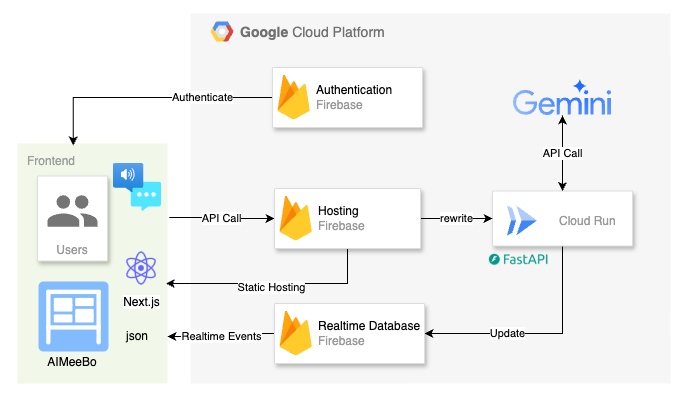

# 📝 リアルタイム議事録生成アプリ「AI Meeting Board」（愛称：AIMeeBo）

## 📌 概要

本アプリは、**ユーザーのテキスト入力または音声入力をトリガーとして、LLM（Vertex AI Gemini）を用いてリアルタイムに会議情報（タスク、参加者、ノート、議題、概要図）を生成・更新し、表示するNext.jsベースのウェブアプリケーション**です。Firebase Realtime Database を活用したSPA（Single Page Application）として構築されており、データのリアルタイム同期とサーバーレスアーキテクチャにこだわっています。愛称の「AIMeeBo」は「あいみーぼ」と読みます。

「今日の会議の議事録、誰が書く？」「あのタスク、誰が担当するんだっけ？」「議論に集中したいのに、メモを取るのに必死で話が頭に入ってこない…」といった会議の「見えないコスト」を、AIの力で解消することを目指しています。

新規ルーム作成時には、Firebase Realtime Database に保存されている `template` という名前のテンプレートルームを基に作成されます。バックエンドはPython (FastAPI) で構築され、中央のオーケストレーターLLMが専門エージェントLLM群（タスク管理、参加者管理、ノート生成、アジェンダ管理、概要図生成）を制御します。


## 🎯 目的

*   複数人の会議におけるリアルタイムな情報管理（タスク、参加者、ノート、議題、概要図）。
*   会議の「見えないコスト」（議事録作成、タスク管理、情報整理など）を削減し、参加者が議論に集中できる環境の提供。
*   LLMによる文脈理解に基づいた柔軟なデータ更新。
*   オーケストレーターLLMによる適切な専門エージェントへの処理委譲。
*   **Firebase Realtime Databaseによるデータのリアルタイム同期と、サーバーレスアーキテクチャによるスケーラブルで効率的な運用。**
*   Next.jsによるリアルタイムUI表示。
*   Vertex AI (Gemini) と Firebase を組み合わせたサーバーレス・リアルタイムアーキテクチャの実現。

## 🏗️ アーキテクチャ概要



```
[Next.js Frontend (React UI)]
       │ (ユーザー入力 + 会話履歴)
       │
       ▼ REST API (/invoke)
[FastAPI Backend (meeting-mate-app/server/)]
       │ (main.py: APIルーティング、起動処理)
       │
       │ ◄── [API Key Manager (Firebase Realtime Database)]
       │      (room_secrets/{roomId}: 暗号化されたAPIキーを安全に管理)
       │
       ▼ [Orchestrator LLM (main.py 内 dispatch_to_agent)]
       │    (ユーザー入力、会話履歴、セッションデータ概要を分析し、
       │     呼び出すべき専門エージェントと指示を決定)
       │
       ├─指示─► [Task Management Agent (agents/task_agent.py)]
       │          (LLMがタスクリストを更新 → Firebase "tasks" を更新)
       │
       ├─指示─► [Notes Generator Agent (agents/notes_agent.py)]
       │          (LLMがノート項目を更新 → Firebase "notes" を更新)
       │
       ├─指示─► [Agenda Management Agent (agents/agenda_agent.py)]
       │          (LLMが議題を推定 → Firebase "currentAgenda", "suggestedNextTopics" を更新)
       │
       └─指示─► [Overview Diagram Agent (agents/overview_diagram_agent.py)]
                  (LLMが概要図を更新 → Firebase "overviewDiagram" を更新)

[Firebase Realtime Database (データストア)]
├─ rooms/{roomId}/          ← フロントエンドアクセス可能 (リアルタイム同期の核)
│  ├─ participants/
│  ├─ tasks/
│  ├─ notes/
│  └─ transcript/
└─ room_secrets/{roomId}/   ← バックエンドのみアクセス可能
   ├─ encrypted_api_key
   ├─ expires_at
   └─ created_by
```
[Firebase Realtime Database (データストア)]
(models.py: データモデル定義 - Pydanticモデル)
(config.py: 設定、Vertex AI初期化、ロガー)
(Firebase Admin SDK: Firebase Realtime Databaseへのアクセス)


*   **Next.js Frontend**: `meeting-mate-app/src/app/room/page.tsx` で実装。ユーザーインターフェースを提供し、入力された最新発言1件を `LLMMessage` 形式でFastAPIバックエンドに送信。**Firebase Realtime Databaseとのリアルタイム同期により、バックエンドからの更新を即座にUIに反映します。**
*   **FastAPI Backend**: `meeting-mate-app/server/` ディレクトリ以下で実装。
    *   `main.py`: FastAPIアプリケーションのメインファイル。APIルーティング、ディスパッチャー関数のコアロジック、アプリケーションの起動処理。
    *   `agents/` ディレクトリ: 各専門エージェントのハンドラー関数を格納。
        *   `task_agent.py`: タスク管理エージェント。
        *   `participant_agent.py`: 参加者管理エージェント。
        *   `notes_agent.py`: ノート生成エージェント。
        *   `agenda_agent.py`: アジェンダ管理エージェント。
        *   `overview_diagram_agent.py`: 概要図生成エージェント。
    *   `models.py`: Pydanticモデル定義（`LLMMessage`, `DBTranscriptEntry` など）。
    *   `config.py`: 設定変数、ロガー、Vertex AI初期化など。
    *   `main.py` 内で Firebase Admin SDK を使用して Firebase Realtime Database とのデータ送受信を処理。
    フロントエンドからのリクエストを受け付け、ディスパッチャーLLMを介して各種専門エージェントを呼び出し、Firebase Realtime Database を更新。更新結果をフロントエンドに返す。

---

## 🧠 バックエンドコンポーネント詳細

### 1. メイン処理 (`meeting-mate-app/server/main.py`)
*   **APIエンドポイント (`POST /invoke`)**: フロントエンドからのリクエスト（ユーザーの最新発言と会話履歴を含む）を受け付けます。
*   **ディスパッチャーLLM (`orchestrate_agents` 関数)**:
    *   **役割**: 受信したユーザー発言（DBから取得したトランスクリプトをLLMMessage形式に変換したもの）、現在のセッションデータ（タスク、参加者、ノート、議題、概要図の概要）を分析し、どの専門エージェントにどのような処理を依頼するかをLLM（Vertex AI）に判断させます。
    *   **入力**:
        *   DBから取得・変換されたトランスクリプト履歴 (`LLMMessage` のリスト)。
        *   現在のセッションデータの概要 (Firebase Realtime Database から取得)。
    *   **LLMへの指示**: 上記入力に基づき、呼び出すべき専門エージェント（`TaskManagementAgent`, `NotesGeneratorAgent`, `AgendaManagementAgent`, `OverviewDiagramAgent`）と、各エージェントへの簡単な指示を **`[{"agent_name": "エージェント名", "instruction": "具体的な指示内容"}]`** というJSON形式のリストで返すよう指示します。
    *   **出力**: パースされたLLMの指示に基づき、対応する専門エージェントのハンドラー関数（各`agents/*.py`ファイル内）を呼び出します。
*   **アプリケーション起動と設定**: FastAPIアプリケーションの初期化、CORS設定、Firebase Admin SDK および Vertex AI の初期化呼び出しなど。

### 2. 専門エージェントハンドラー群 (`meeting-mate-app/server/agents/` 内)
各エージェントファイル内の `execute` メソッドは、ディスパッチャーLLMからの指示と関連情報を基に、それぞれの専門領域のデータをLLM（Vertex AI）を使って更新し、更新後のデータとユーザー向けメッセージを返します。データは Firebase Realtime Database に保存されます。

*   **タスク管理 (`agents/task_agent.py`)**:
    *   LLMが、指示、会話履歴、現在のタスクリストを考慮して、Firebase Realtime Database 内の `tasks` を更新します。
*   **参加者管理 (`agents/participant_agent.py`)**:
    *   LLMが、指示、会話履歴、現在の参加者リストを考慮して、Firebase Realtime Database 内の `participants` を更新します。
    *   現在はシンプルな構成にするため機能無効化中
*   **ノート生成 (`agents/notes_agent.py`)**:
    *   LLMが、指示、会話履歴、現在のノート項目リストを考慮して、Firebase Realtime Database 内の `notes` を更新します。
*   **アジェンダ管理 (`agents/agenda_agent.py`)**:
    *   LLMが、指示、会話履歴、現在の議題情報を考慮して、Firebase Realtime Database 内の `currentAgenda` および `suggestedNextTopics` を更新します。
*   **概要図生成 (`agents/overview_diagram_agent.py`)**:
    *   LLMが、指示、会話履歴、現在の概要図情報を考慮して、Firebase Realtime Database 内の `overviewDiagram` を更新します。

### 3. その他ユーティリティ (`meeting-mate-app/server/` 内)
*   **`models.py`**: アプリケーションで使用されるPydanticデータモデル（`LLMMessage`, `DBTranscriptEntry`, リクエスト/レスポンス形式、タスク構造など）を定義します。
*   **`config.py`**: 環境変数からの設定読み込み、Vertex AIの初期化処理、ロガーの設定など、アプリケーション全体の設定関連のコードを管理します。
*   **`file_utils.py`**: (現在は主にエージェント設定ファイルの読み込み等に使用。DB操作は `main.py` 内で Firebase Admin SDK を直接使用)

---

## 🗄️ データストア

*   **Firebase Realtime Database**: 主要なデータストアとして機能します。
    *   **目的**: **リアルタイム同期による即時性、サーバーレスアーキテクチャとの高い親和性、スケーラビリティの向上。**
    *   **スキーマ**: [Firebase Realtime Database スキーマ案](#firebase-realtime-database-スキーマ案) を参照。
        *   **トランスクリプト**: `rooms/{roomId}/transcript` には、`DBTranscriptEntry` スキーマ (`{"text": string, "user": string (発言者名), "timestamp": string}`) の配列として保存されます。
    *   **アクセス制御**: Cloud Runのサービスアカウントからのアクセスのみを許可するセキュリティルールを適用します。クライアントからの直接的なデータベース読み書きは禁止し、すべてのデータ操作はFastAPIバックエンド経由で行います。

---

## ☁️ デプロイアーキテクチャ

以下のアーキテクチャでGoogle Cloud Platform上にデプロイします。**FirebaseサービスとCloud Runを組み合わせることで、フルマネージドなサーバーレスアーキテクチャを実現しています。**

### API ルーティングアーキテクチャ

**Firebase Hosting + Cloud Run 統合モード** を採用しており、フロントエンドからのAPI呼び出しはすべて相対URLで行われ、環境に応じて適切にルーティングされます。

#### 本番環境 (Firebase Hosting)
```
フロントエンド → /invoke → Firebase Hosting Rewrites → Cloud Run FastAPI
フロントエンド → /join_room → Firebase Hosting Rewrites → Cloud Run FastAPI
フロントエンド → /create_room → Firebase Hosting Rewrites → Cloud Run FastAPI
フロントエンド → /approve_join_request → Firebase Hosting Rewrites → Cloud Run FastAPI
```

#### 開発環境 (Next.js Dev Server)
```
フロントエンド → /invoke → Next.js Dev Proxy → localhost:8000 FastAPI
フロントエンド → /join_room → Next.js Dev Proxy → localhost:8000 FastAPI
フロントエンド → /create_room → Next.js Dev Proxy → localhost:8000 FastAPI
フロントエンド → /approve_join_request → Next.js Dev Proxy → localhost:8000 FastAPI
```

この設計により:
- **環境変数でのバックエンドURL指定が不要**
- **本番環境でFirebase HostingとCloud Runの統合メリットを最大化**
- **開発環境でローカルFastAPIサーバーとのシームレスな連携**
- **デプロイ時の設定変更が不要**

*   **フロントエンド**: Next.jsアプリケーションを静的サイトとしてエクスポート (`next export`) し、Firebase Hostingにデプロイします。`/room/[roomId]`のような動的ルーティングのページは、クライアントサイドレンダリング (CSR) を利用し、Firebase Realtime Databaseから直接データを取得します。**Firebase Realtime Databaseのリアルタイムリスナーにより、バックエンドからのデータ更新が即座にフロントエンドに反映されます。**
*   **バックエンド**: FastAPIアプリケーションをコンテナ化し、Google Cloud Runにデプロイします。リクエストベースの課金で運用する**サーバーレスサービス**です。
*   **データベース**: Firebase Realtime Databaseを使用します。データ構造は[こちら](#firebase-realtime-database-スキーマ案)を参照。
*   **AI**:引き続きVertex AIを利用します。
*   **CI/CD**: Cloud Buildを利用して、ソースコードの変更をトリガーに自動でビルドとデプロイを行います（予定）。
*   **Secrets Management**: APIキーやデータベース接続情報などの機密情報はSecret Managerで管理し、Cloud Runから安全に参照します（予定）。
*   **インフラ管理**: Terraformを使用して、上記のリソースをコードで管理します。構成ファイルは `environments/` ディレクトリに配置します。

### Firebase Realtime Database 当初スキーマ案
```json
{
  "rooms": {
    "room_id_1": {
      "sessionId": "session-12345",
      "roomName": "新規プロジェクト会議",
      "meetingSubtitle": "キックオフと初期計画",
      "sessionTitle": "プロジェクトキックオフミーティング",
      "startTime": "2024-05-20T10:00:00Z",
      "ownerId": "owner_uid_123",
      "participants": {
        "user_uid_1": {
          "name": "田中",
          "role": "参加者",
          "joinedAt": "2024-05-20T10:00:00Z"
        }
      },
      "tasks": {
        "task_id_1": {
          "id": "task_id_1",
          "title": "API仕様書の作成",
          "status": "未着手",
          "detail": "RESTful APIの設計書を作成する"
        }
      },
      "notes": {
        "note_id_1": {
          "id": "note_id_1",
          "type": "decision",
          "title": "採用技術の決定",
          "detail": "Next.js + FastAPI構成で決定"
        }
      },
      "overviewDiagram": {
        "title": "会議の概要図",
        "mermaidDefinition": "graph TD;\nA[会議開始] --> B(議題1);\nB --> C{議論};\nC --> D[決定事項];"
      },
      "currentAgenda": {
        "mainTopic": "次期プロジェクトの計画",
        "details": [
          {"id": "detail_1", "text": "現状の課題整理"},
          {"id": "detail_2", "text": "新機能の提案"}
        ]
      },
      "suggestedNextTopics": ["予算策定", "リソース確保"],
      "transcript": [
        {
          "text": "最初の発言です。",
          "user": "田中",
          "timestamp": "2024-05-20T10:00:00Z"
        }
      ],
      "last_llm_processed_message_count": 0
    }
  },
  "room_secrets": {
    "room_id_1": {
      "encrypted_api_key": "gAAAAABh...(暗号化されたAPIキー)",
      "expires_at": "2024-05-21T10:00:00Z",
      "created_at": "2024-05-20T10:00:00Z",
      "created_by": "owner_uid_123",
      "llm_models": ["gemini-2.5-flash"]
    }
  }
}
```

### Firebase Realtime Database セキュリティルール
```json
{
  "rules": {
    "rooms": {
      "$roomId": {
        ".read": "auth != null && root.child('rooms').child($roomId).child('participants').hasChild(auth.uid)",
        ".write": false
      }
    },
    "room_secrets": {
      ".read": false,
      ".write": false
    }
  }
}
```

## 🔁 処理フロー詳細

1.  **音声認識・テキスト入力**: ユーザーがフロントエンドUI (`room/page.tsx`) の入力エリアから発言を入力します。メインは音声認識で、サブ機能としてテキスト入力を位置づけています。
2.  **APIリクエスト**: フロントエンドは、入力された最新発言1件を `LLMMessage` 形式 (`{"role": "user", "parts": [{"text": "..."}]}`) で `callBackendApi` 関数を介してFastAPIサーバーの `/invoke` エンドポイントに送信します。この際、`roomId` と `speakerName` も送信されます。
3.  **トランスクリプト保存**: FastAPIサーバー (`main.py` の `/invoke` エンドポイント) はリクエストを受け取り、まず送信された最新メッセージを `DBTranscriptEntry` 形式 (`{"text": string, "user": string, "timestamp": string}`) に変換し、Firebase Realtime Database の該当ルームの `transcript` 配列に追記します。
4.  **ディスパッチャー処理**:
    *   `LLM_TRIGGER_MESSAGE_COUNT` の条件を満たした場合、または音声認識の最終結果が得られた場合に、`orchestrate_agents` 関数が呼び出されます。
    *   `orchestrate_agents` は、Firebase Realtime Database から現在のルームの全トランスクリプト（`DBTranscriptEntry` のリスト）とその他のセッションデータ（タスク、参加者など）を取得します。
    *   DBから取得したトランスクリプトをLLM処理用の `LLMMessage` 形式のリストに変換します。
    *   LLM（Vertex AI）に、変換後のトランスクリプト履歴と現在のセッション概要を渡し、どの専門エージェントを呼び出すべきか、その指示内容の判断を依頼します（期待する応答形式は `[{"agent_name": "エージェント名", "instruction": "具体的な指示内容"}]`）。
5.  **専門エージェント実行 (バックグラウンドタスク)**:
    *   ディスパッチャーはLLMの判断結果に基づき、該当する専門エージェントの `execute` メソッドを、LLMが生成した指示と共にバックグラウンドタスクとして呼び出します。
    *   各専門エージェントは、再度LLM（Vertex AI）を呼び出し、与えられた指示、会話履歴（`LLMMessage` 形式）、関連する現在のデータ（例: タスクリスト）を基に、データの具体的な更新内容（例: 更新後のタスクリスト全体）とユーザー向けメッセージを生成させます。
6.  **データ更新とUIリアルタイム同期**:
    *   専門エージェントは、LLMが生成した更新データで Firebase Realtime Database の対応部分を書き換えます。
    *   **Firebase Realtime Databaseのリアルタイム同期機能により、データが更新されると即座にフロントエンドのUIが自動的に更新されます。**
    *   `/invoke` エンドポイントは、起動されたエージェントのリストや、DBから再取得した最新のセッションデータ（例: `updatedTasks`, `updatedParticipants` など）をフロントエンドに返します。
7.  **UI更新**: フロントエンドはサーバーからの応答を受け取り、対応するReactのstate（`tasks`, `participants`, `notes`, `currentAgenda`, `overviewDiagram` など）を更新し、UIがリアルタイムに再レンダリングされます。更新があったパネルのみがホワイトアウトするアニメーションが適用されますが、技術的に困難な場合はこのアニメーションは削除されます。

### 1. 部屋作成フロー
1. **部屋作成者**がフロントエンドで部屋作成（ルーム名、会議サブタイトル、APIキー、LLMモデルを選択）
2. **バックエンド**が部屋情報をFirebase `rooms/{roomId}` に保存（Firebase Realtime Databaseに保存されているテンプレートルーム `template` の内容をコピーして初期化）
3. **APIキー管理**が提供されたAPIキーを暗号化し `room_secrets/{roomId}` に保存
4. **LLMモデル情報**が選択されたLLMモデルリストを `room_secrets/{roomId}` に保存（暗号化不要）
5. **部屋URL**を作成者に返却

### 2. 参加者参加フロー
1. **参加者**が部屋URLにアクセス
2. **認証確認**後、バックエンドの `/join_room` エンドポイントを呼び出し、部屋の `participants` リストに直接追加されます。
3. **フロントエンド**が `rooms/{roomId}` の読み取り権限を取得
4. **リアルタイム同期**開始

### 3. LLM処理フロー
1. **ユーザー入力**: 参加者がメッセージを入力（音声入力も可能）
2. **トランスクリプト保存**: Firebase `rooms/{roomId}/transcript` に追記
3. **LLM処理トリガー**: 指定件数に達したら `orchestrate_agents` 実行
4. **APIキー取得**: `room_secrets/{roomId}` から暗号化APIキーを復号化
5. **LLMモデル取得**: `room_secrets/{roomId}` から選択されたLLMモデルリストを取得
6. **ディスパッチャー実行**: 取得したAPIキーと選択されたLLMモデルを使用してVertex AI呼び出し
7. **専門エージェント実行**: 各エージェントが同じAPIキーとLLMモデルでLLM処理
8. **データ更新**: Firebase `rooms/{roomId}/` の各データを更新
9. **フロントエンド更新**: **Firebase Realtime Databaseのリアルタイム同期機能により、UIが自動的に更新されます。**

## 🛡️ セキュリティ設計

### アクセス制御
- **フロントエンド**: `rooms/{roomId}` のみアクセス可能
- **バックエンド**: Firebase Admin SDKで全データアクセス可能
- **APIキー**: `room_secrets/` は完全にバックエンド専用

### 暗号化
- **APIキー**: Fernet暗号化で可逆暗号化
- **暗号化キー**: 環境変数（将来的にSecret Manager）
- **通信**: HTTPS必須

### TTL管理
- **自動期限切れ**: 24時間後にAPIキー無効化
- **定期削除**: Cloud Schedulerで期限切れキー削除
- **手動削除**: 部屋削除時にAPIキーも削除

---

## 💻 フロントエンド実装詳細 (Next.js, React)

*   **主要ファイル**:
    * `meeting-mate-app/src/app/room/page.tsx` (会議ルームページ)
    * `meeting-mate-app/src/app/page.tsx` (ホームページ)
    * `meeting-mate-app/src/app/create/page.tsx` (ルーム作成ページ)
    * `meeting-mate-app/src/app/join/page.tsx` (ルーム参加ページ)
    * `meeting-mate-app/src/app/board.tsx` (会議ボードコンポーネント)
*   **データフロー**:
    *   初期データは、ルーム参加時にFirebase Realtime DatabaseのJavaScript SDKを直接利用して取得されます。
    *   `useRoomData` フックを使用して、Firebase Realtime Databaseからのデータをリアルタイムで取得・監視します。
    *   ユーザーがメッセージを入力し送信すると、`useBackendApi` フックの `callBackendApi` 関数がトリガーされます。
    *   `callBackendApi` 関数が、最新のメッセージ1件を `LLMMessage` 形式でFastAPIバックエンド (`/invoke`) に送信します。これは主にLLMへのメッセージ送信と、LLMによるデータ更新のトリガーを目的とします。
    *   **Firebase Realtime Databaseのデータが更新されると、フロントエンドはリアルタイムリスナーを通じてその変更を検知し、対応するReactのstate（`tasks`, `participants`, `notes`, `currentAgenda`, `overviewDiagram` など）を更新し、UIに即座に反映します。**
    *   各情報パネルは、対応するデータが存在しない場合は表示されず、データが追加されると動的に表示されます。新規ルーム作成時は、テンプレートルームの内容が少ないため、初期表示されるパネルも少なくなります。
    *   パネルが表示される際には、更新があったパネルのみにホワイトアウトするアニメーションが適用され、視覚的に目立つようにします。
*   **発言者**: ユーザーがルームに参加する際に認証情報から取得した表示名 (`speakerName`) が使用され、バックエンドに送信されます。
*   **デバッグ用ポップアップ**: 以前使用していた `alert` によるデバッグ用ポップアップは削除され、情報は主にブラウザのコンソールに出力されます。
*   **音声入力ボタン**: 「デバッグ用入力」として設定されていた「音声入力開始」ボタンは、正式機能としてUIに配置されます。

### 音声認識機能の現状

*   フロントエンド (`meeting-mate-app/src/app/room/page.tsx`) に、ブラウザ標準の Web Speech API を利用した音声認識機能が実装されています。`useSpeechRecognition` フックを使用して、音声認識の状態管理と処理を行います。
*   **iOSデバイスでの動作について**: iOSのSafariブラウザではWeb Speech APIのサポートが限定的であるため、音声認識機能が期待通りに動作しない場合があります。これはブラウザの制約によるものであり、アプリケーションのコードレベルでの直接的な解決は難しい可能性があります。

---

## 🛠️ セットアップと実行

### 必要なもの
*   Node.js, npm
*   Python 3.x, pip
*   Google CloudプロジェクトとVertex AI APIの有効化、認証設定（`GOOGLE_APPLICATION_CREDENTIALS` 環境変数の設定など）。

### 環境変数
プロジェクトルートに `.env` ファイルを作成し、以下を設定します。`.env.example` ファイルをコピーして使用することをお勧めします。

```bash
cp .env.example .env
```

設定が必要な主要な環境変数：
- `PROJECT_ID`: あなたのGCPプロジェクトID
- `REGION`: GCPリージョン（例: us-central1）
- `LLM_MODEL`: 使用するVertex AIモデル名（例: gemini-2.5-flash）
- `FIREBASE_DATABASE_URL`: Firebase Realtime DatabaseのURL
- `GOOGLE_APPLICATION_CREDENTIALS`: サービスアカウントキーファイルのパス
- `ENCRYPTION_KEY`: APIキー暗号化用のFernetキー
- `GEMINI_API_KEY`: Gemini APIキー
- `NEXT_PUBLIC_FIREBASE_CONFIG`: Firebase設定（JSON形式）
- `NEXT_PUBLIC_BACKEND_API_URL`: バックエンドAPIのURL（開発時は http://127.0.0.1:8000）

**重要**: `NEXT_PUBLIC_BACKEND_API_URL` 環境変数は不要になりました。API呼び出しは相対URL（例: `/invoke`）で行われ、環境に応じて自動的にルーティングされます。

## 🚀 セットアップ手順

### 1. 前提条件
- Node.js (v18以上)
- Python 3.8以上
- Google Cloudアカウント
- Firebaseプロジェクト

### 2. GCPプロジェクトの設定
1. [Google Cloud Console](https://console.cloud.google.com/)でプロジェクトを作成
2. 以下のAPIを有効化：
   - Vertex AI API
   - Firebase Realtime Database API
   - Cloud Run API（本番デプロイ時）
3. サービスアカウントを作成し、以下の権限を付与：
   - Firebase Admin SDK Administrator Service Agent
   - Vertex AI User
4. サービスアカウントキーをJSONファイルとしてダウンロード

### 3. Firebaseプロジェクトの設定
1. [Firebase Console](https://console.firebase.google.com/)でプロジェクトを作成（既存のGCPプロジェクトを使用可能）
2. Realtime Databaseを有効化
3. Firebase設定を取得（プロジェクト設定 > 全般 > ウェブアプリ）

### 4. 環境設定
1. リポジトリをクローン：
```bash
git clone <repository-url>
cd <repository-name>
```

2. 環境変数ファイルを作成：
```bash
cp .env.example .env
```

3. `.env` ファイルを編集し、あなたのプロジェクト情報を設定

4. Firebase設定ファイルを作成：
```bash
cd meeting-mate-app
cp .firebaserc.example .firebaserc
cp firebase.json.example firebase.json
```

5. Firebase設定ファイルを編集し、あなたのプロジェクト情報を設定

### 5. 暗号化キーの生成
`ENCRYPTION_KEY` は、APIキーを暗号化・復号化するために必要です。以下のPythonコードを実行して生成してください：

```python
from cryptography.fernet import Fernet
key = Fernet.generate_key()
print(key.decode()) # この出力を.envファイルのENCRYPTION_KEYに設定
```

## 🏃‍♂️ 実行手順

### 6. バックエンドサーバー (FastAPI)

1. `meeting-mate-app/server` ディレクトリに移動：
```bash
cd meeting-mate-app/server
```

2. 必要なPythonライブラリをインストール：
```bash
pip install -r requirements.txt
```

3. サーバーを起動：
```bash
python main.py
```
サーバーは `http://localhost:8000` で起動します。

### 7. フロントエンド開発サーバー (Next.js)

1. `meeting-mate-app` ディレクトリに移動（別のターミナルで）：
```bash
cd meeting-mate-app
```

2. 依存関係をインストール：
```bash
npm install
```

3. 開発サーバーを起動：
```bash
npm run dev
```
アプリケーションは `http://localhost:3000` でアクセスできます。

### Terraform (インフラ構築)
Terraform関連のファイル (`environments/` ディレクトリ) にデプロイ用のリソースを作成しています。

## 🗄️ データ構造 (Firebase Realtime Database)

主要なデータは Firebase Realtime Database の `rooms/{roomId}/` 以下に格納されます。
詳細なスキーマは上記の [Firebase Realtime Database スキーマ案](#firebase-realtime-database-スキーマ案) を参照してください。

特にトランスクリプトは `rooms/{roomId}/transcript` に以下の形式のオブジェクトの配列として保存されます。
```json
{
  "text": "ユーザーまたはエージェントの発言内容",
  "user": "発言者名またはエージェント識別子 (例: '田中', 'agent:NotesGeneratorAgent')",
  "timestamp": "発言のタイムスタンプ (ISO 8601形式)"
}
```


#### ライアントサイドルーティング + Firebase Hosting Rewrites（採用）
- `/room/[roomId]` を `/room.html` にリダイレクト
- クライアントサイドでURLからroomIdを取得
- 最もシンプルで実現可能
- 現在のアーキテクチャとの親和性が高い

**実装方針**:
1. `/room/[roomId]/page.tsx` を `/room/page.tsx` に移動
2. Firebase Hosting rewritesの設定調整
3. クライアントサイドでURLパラメータからroomIdを抽出

## 動作確認デバイス
### Mac
- Chrome: 可
- Vivaldi: 不可
### Android
- Chrome: 可
### iPad
- Chrome: 不可
- Safari: 可

## 補記
- このDevcontainer環境は下記をベースに作成しました。感謝申し上げます。
  - https://github.com/a5chin/terraform-template.git
- このプロジェクトは[第2回 AI Agent Hackathon with Google Cloud](https://zenn.dev/hackathons/google-cloud-japan-ai-hackathon-vol2?tab=overview) への提出物として作成しました。
